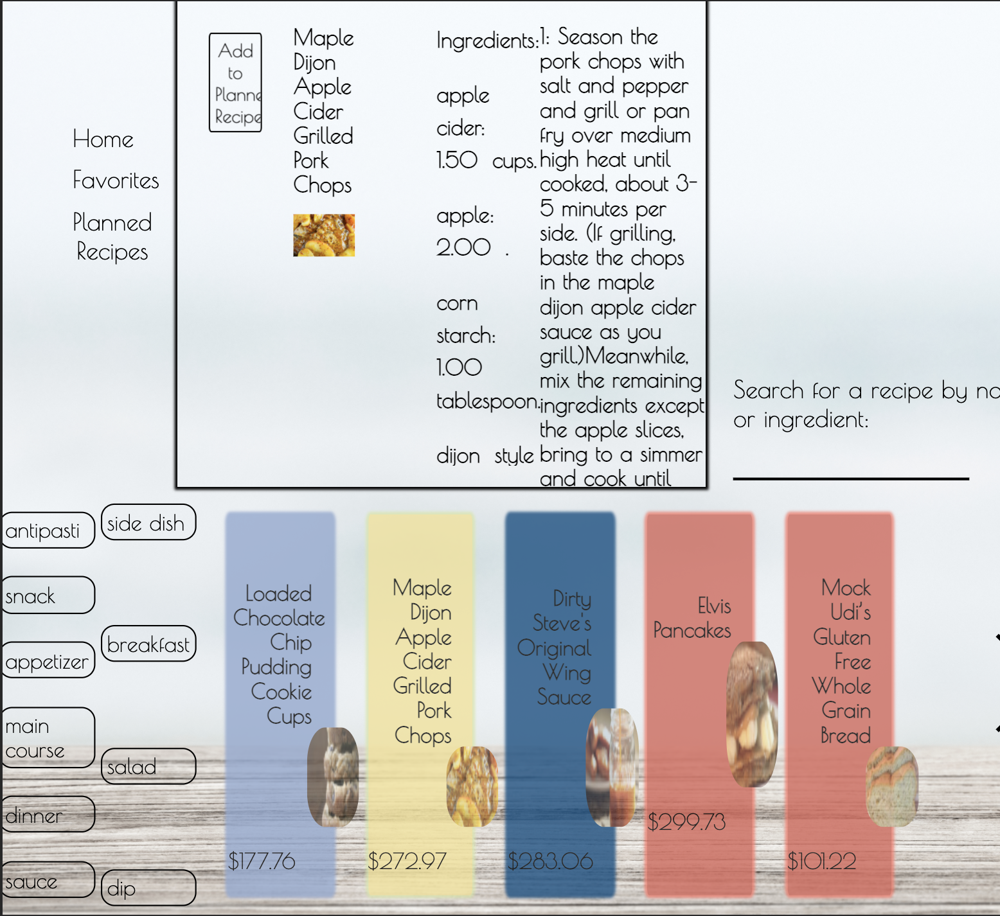

## What's Cooking?

### User:
#### Each user has a pantry in which they store their ingredients.  They have access to a number of recipes and may add them to either their favorites or a list of planned meals.  As a user you may cook a meal if you have the required ingredients.  This will remove the items from your pantry.  

#### 1. Take a look around in the cookbook
####   * You may filter the list of cards that appear to your liking by clicking the tags on the left panel that describe your preferred recipes.  When enabled, the tag will appear green and yopu will see only recipes that include this descriptor.
####   * You may also filter the list of cards by ingredient included or recipe name.  This is done on the right side of the screen in the input field.  
####   * You will see the cost of each recipe on it's card.
####   * If you like a recipe, click on it's star at the top right to favorite it. The star will turn yellow to indicate that you have it in your Favorites list. At any point inside or outside of your favorites tab you may unfavorite it by clicking the star again to un-highlight it. 

#### 2. Clicking on a recipe will bring it into a feature box where you may see it's Ingredients, any ingredients that may be missing out of your cupboard, and the instructions to follow when cooking. You will have the option to cook this recipe only if you have the required __amount__ of ingredients in your pantry. 

#### 3. From the feature window, Clicking "Add to Planned Recipes" button will add this recipe to your list of planned recipes for the week. At any point you may remove the recipe with the "Remove from my Planned Recipes" button.

#### 4. To view your Planned Recipes, click the "Planned Recipes" button in your User menu at the top left. This will enable you to see your pantry and determine more about what you would like to make in the future. If cooking is disabled for a featured recipe that you have chosen, this is simply indicating that your pantry does not have enough of the right ingredients.

#### 5. To view your Favorite Recipes, click the "Favorites" button in your User menu at the top left.

#### 6.  To cook a meal, when you have it chosen as a feature and are ready to follow the instructions, click the "Cook" button at the top left of the feature window that appears if your pantry is supplied for this meal.  This will ensure that your pantry is updated to the proper amounts of ingredients.

---
#### Images of mobile and tablet versions 

---
#### Future Updates
      Future Updates to this project include a refactoring of the ingredient class to include in it's constructor a recipe name.  This would help developer empathy and latency both by allowing methods to simplify their process of searching for id's and matching the id in the ingredient data set (which includes the ingredient's name) to apply a name to the recipe. Currently there is some prototype method nesting that can be resolved by this refactor.
      
      Another future feature of this project is a refactoring of the media queries in css styles.  Although the functionality is manageable, there are some adjustments to the appearance of images and the ingredients list for the feature recipe that could make it easier to read and understand.  This will require some html adjustments and building back up after the elements are correctly positioned for maintanence.
      
---

### [Jackson McGuire](https://github.com/Jacksonmcguire) & [Chuck Morris](https://github.com/percworld)
### [Turing School of Software and Design](https://turing.io/programs/?gclid=Cj0KCQiA962BBhCzARIsAIpWEL2-Y9JxknMSsp6VvxDo7JhiVuRIZ10RTcD90NvJXyZuqkUB3R8BY5AaAkXlEALw_wcB)
